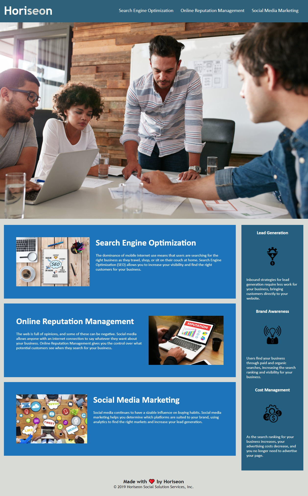

# Code Refactor
*Horiseon Marketing webpage updates for accessibility.*

[View Deployed Application Here.](https://pythonidaer.github.io/Code-Refactor/)

## Installation
1. Clone repository to your local device
2. Folders are structured already, so test by opening the index.html file in your browser. If it looks good, it's working right.

## Usage
This repo is simply a homework assignment. Feel free to inspect the code and notice how I made the website more accessible through the following updates:
* alt="" attributes on the  tags
* Semantic HTML5 Markup (`<header>`, `<footer>`, instead of `
`, etc.)
* Working `<a>` links
* `` tag containing aria-label="" for the CSS background
  
## Credits
[Smashing Magazine](https://www.smashingmagazine.com/2020/01/html5-article-section/) helped me understand the difference between `<section>` and `<article>`

[David Mac D](http://www.davidmacd.com/blog/alternate-text-for-css-background-images.html) taught me how to add alt="" attributes to CSS backgrounds

[Google Lighthouse](https://developers.google.com/web/tools/lighthouse#devtools) provided the tools I needed to test my webpage for accessibility

[GitHub Markdown](https://guides.github.com/features/mastering-markdown/) taught me how to style my README with markdown!
  
## License
I've chosen an MIT License. Do what you'd like with this material.

#### The Proof

#### The Website

